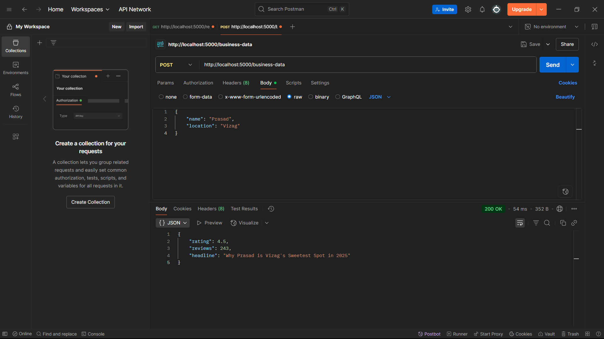
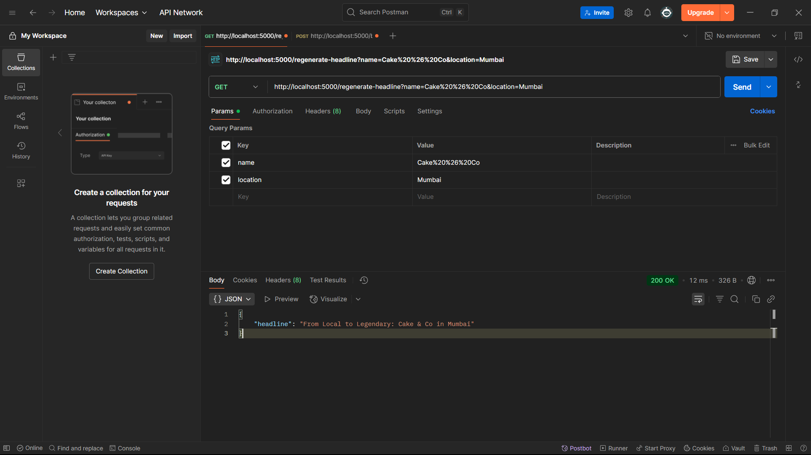

# GrowthProAI Backend

This is the backend server for the GrowthProAI Mini Dashboard assignment. It provides mock API endpoints to simulate business data and SEO headline generation.

## 🚀 Features

- Built with **Node.js** and **Express.js**
- Two main endpoints:
  - `POST /business-data`
  - `GET /regenerate-headline`
- Uses mock data — no database required
- CORS enabled for frontend integration

---

## 🛠️ Setup Instructions

### 1. Clone the Repository

```bash
git clone https://github.com/prasadchodagiri7989/growthpro-backend.git
cd backend
```

### 2. Install Dependencies

```bash
npm install
```


### 3. Start the Server

```bash
node server.js
```

The backend server will start on `http://localhost:5000`.

---

## 📡 API Endpoints

### 1. POST `/business-data`

**Description:** Accepts business name and location. Returns mock rating, reviews, and an SEO headline.

#### ✅ Example Request:

```json
POST http://localhost:5000/business-data
{
  "name": "Cake & Co",
  "location": "Mumbai"
}
```

#### ✅ Example Response:

```json
{
  "rating": 4.3,
  "reviews": 127,
  "headline": "Why Cake & Co is Mumbai's Sweetest Spot in 2025"
}
```



---

### 2. GET `/regenerate-headline?name=...&location=...`

**Description:** Returns a new mock SEO headline.

#### ✅ Example Request:

```http
GET http://localhost:5000/regenerate-headline?name=Cake%20&%20Co&location=Mumbai
```

#### ✅ Example Response:

```json
{
  "headline": "Discover Why Cake & Co Dominates Mumbai's Dessert Scene"
}
```



---

## 🧪 Testing with Postman

You can test the API using Postman:

1. Import or manually create two requests for the above endpoints.
2. Use `body > raw > JSON` for the POST request.
3. Observe the returned mock data.

---

## 📂 Folder Structure

```
backend/
├── controllers/
│   └── businessController.js
├── routes/
│   └── businessRoutes.js
├── utils/
│   └── generateHeadline.js
├── app.js
├── server.js
├── package.json
├── package-lock.json
├── README.md
```

---

## 📌 Notes

- All responses are served from memory.
- No persistent storage or database is used.
- Ideal for demonstration purposes and frontend API integration.

